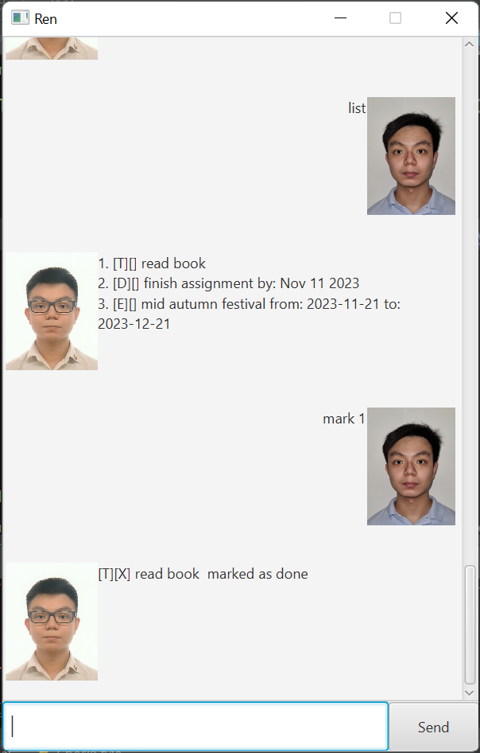

# Ren User Guide
Ren is a desktop app for managing tasks with a simple a Graphical User Interface (GUI).
If you can type fast, Ren can get your task management done faster than traditional GUI apps.

* Table of Contents

--------------------------------------------------------------------------------------------------------------------

## Quick start

1. Ensure you have Java `11` or above installed in your Computer.

1. Download the latest `Ren.jar` from [here](https://github.com/TeeRenJing/ip/releases).

1. Copy the file to the folder you want to use as the _home folder_ for your AddressBook.

1. Open a command terminal, `cd` into the folder you put the jar file in, and use the `java -jar Ren.jar` command to run the application. 
   A GUI similar to the below should appear in a few seconds. Note how the app contains some sample data. 
   

1. Type the command in the command box and press Enter to execute it. e.g. typing **`help`** and pressing Enter will open the help window. 
   Some example commands you can try:

   * `list` : Lists all tasks.

   * `add todo eat dinner` : Adds a ToDo Task named `eat dinner` to Ren.

   * `delete 1` : Deletes the 1st contact shown in the current list.

1. Refer to the [Features](#features) below for details of each command.

--------------------------------------------------------------------------------------------------------------------

## Features

### Adding a todo: `add todo`

Adds a ToDo Task to Ren.

Format: `add todo NAME`

Examples:
* `add todo Buy groceries`
* `add todo Read book`

### Adding a deadline: `add deadline`

Adds a Deadline Task to Ren.

Format: `add deadline NAME /by DATE`

Examples:
* `add deadline Buy groceries /by 2020-02-02`
* `add deadline Read book /by 2020-02-02`

### Adding an event: `add event`

Adds an Event Task to Ren.

Format: `add event NAME /from DATE /to DATE`

### Mark an event as completed : `mark`

Marks a Task as completed. Index refers to the index number shown in the displayed Task list. The index must be a positive integer 1, 2, 3, ...

Format: `mark INDEX`

Examples:
* `mark 1`

### Unmark an event as not completed : `unmark`

Unmarks a Task as completed. Index refers to the index number shown in the displayed Task list. The index must be a positive integer 1, 2, 3, ...

Format: `unmark INDEX`

Examples:
* `unmark 1`

### Deleting a task : `delete`

Deletes a Task from Ren. Index refers to the index number shown in the displayed Task list. The index must be a positive integer 1, 2, 3, ...

Format: `delete INDEX`

Examples:
* `delete 1`

### Listing all tasks : `list`

Shows a list of all Tasks in Ren.

Format: `list`

### Locating tasks by name: `find`

Finds tasks whose names contain the query.

Format: `find KEYWORD [MORE_KEYWORDS]`

* The search is case-insensitive. e.g `hans` will match `Hans`
* Only the name is searched.
* Substrings will be matched e.g. `Han` will match `Hans`

Examples:
* `find eat` returns `eat` and `John Doe`

### Exiting Ren : `bye`

Exits the app.

Format: `bye`
